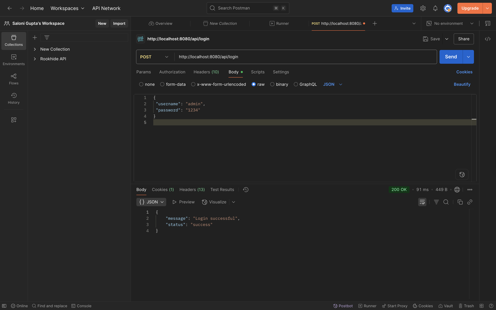
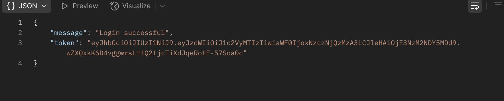
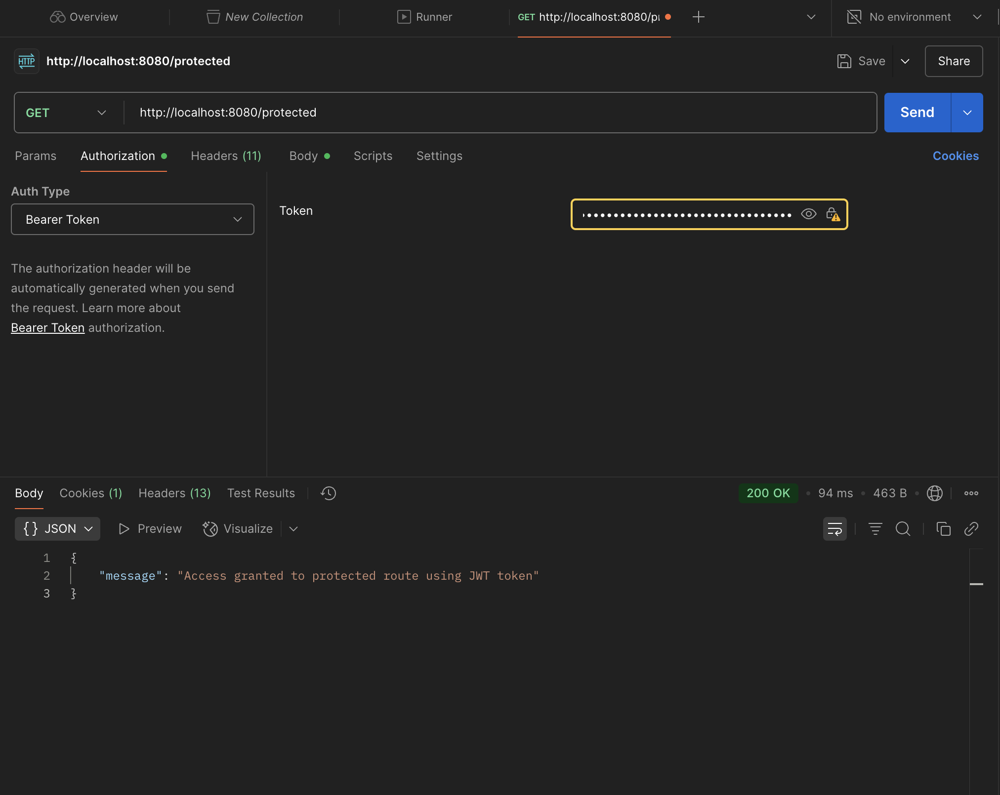

# ScamGuard AI – JWT Authentication Backend + Frontend

This project demonstrates **JWT (JSON Web Token) authentication using Spring Boot** as part of **Experiment 6**.

The system allows users to authenticate using a username and password, receive a JWT token, and access protected routes using that token.

---

# Project Objective

The goal of this project is to implement a **secure authentication mechanism** using JWT in a backend application and demonstrate how protected routes work.

---

# Technologies Used

- Java
- Spring Boot
- Spring Security
- JWT (JSON Web Tokens)
- Maven
- React (Frontend)
- Python (AI scam detection module)
- Postman (API testing)

---

# Project Structure
scamguard/
│
├── backend/
│   └── src/main/java/com/scamguard/backend
│       ├── controller
│       │   ├── AuthController.java
│       │   ├── ScamController.java
│       │   └── UrlController.java
│       │
│       ├── security
│       │   ├── JwtFilter.java
│       │   ├── JwtUtil.java
│       │   └── SecurityConfig.java
│       │
│       └── BackendApplication.java
│
├── frontend/
│   └── React application
│
├── ai-model/
│   ├── train_model.py
│   ├── ai_api.py
│   ├── scam_model.pkl
│   └── vectorizer.pkl
│
├── screenshots/
│   ├── LOGIN.png
│   ├── JWT_TOKEN.png
│   └── PROTECTED_TOKEN.png
│
└── README.md

---

# JWT Authentication Flow

1️⃣ User sends login request with username and password.
Example Request:
{
“username”: “user123”,
“password”: “password123”
}
---

2️⃣ Server validates credentials and generates a JWT token.

Example Response:
{
“message”: “Login successful”,
“token”: “eyJhbGciOiJIUzI1NiIsInR5cCI6IkpXVCJ9…”
}
---

3️⃣ User sends token to access protected route.
Header:
---

4️⃣ Server verifies token using JWT filter.

If valid → Access granted.

Example Response:
{
“message”: “Access granted to protected route”
}
---

# API Endpoints

| Endpoint | Method | Description |
|--------|--------|--------|
| `/login` | POST | Authenticate user and generate JWT token |
| `/protected` | GET | Access protected resource with JWT token |
| `/api/detect-scam` | POST | Detect scam messages using AI model |

---

# Postman Testing

### Login Request
POST http://localhost:8080/login
Body:
{
“username”:“user123”,
“password”:“password123”
}
---

### Access Protected Route
GET http://localhost:8080/protected
Header:
Authorization: Bearer 
---

# Screenshots

### Login Request

---

### JWT Token Generated

---

### Protected Route Access

---

📌 ScamGuard Backend – Experiment 7 (RBAC Implementation)

⸻

🎯 Objective

To implement Role-Based Authorization (RBAC) using Spring Boot and Spring Security with JWT authentication.

⸻

🚀 Features

🔐 Authentication
	•	User Signup (/api/signup)
	•	User Login (/api/login)
	•	JWT Token generation
	•	Stateless authentication

⸻

🛡️ Authorization (RBAC)

Roles implemented:
	•	ROLE_USER
	•	ROLE_ADMIN

⸻

🔑 API Access Control
Endpoint
Access
/api/public/hello
Public
/api/user/profile
USER, ADMIN
/api/admin/dashboard
ADMIN only

⚙️ Security Implementation
	•	Spring Security configured using SecurityFilterChain
	•	Custom JWT Filter (JwtFilter)
	•	Role extracted from JWT token

  🔄 JWT Implementation
	•	Token contains:
	•	Email (subject)
	•	Role (claim)
	•	Token validated on every request
	•	SecurityContext updated dynamically

🧪 Postman Testing

✅ Public Endpoint
GET /api/public/hello
✔ 200 OK (No authentication)
✅ Signup
POST /api/signup
✔ User created
✔ Role assigned: ROLE_USER
✔ Token generated
✅ Login
POST /api/login
✔ Returns JWT token
✅ USER → USER Endpoint
GET /api/user/profile
✔ 200 OK
❌ USER → ADMIN Endpoint
GET /api/admin/dashboard
✔ 403 Forbidden
❌ Without Token
GET /api/user/profile
✔ 401 Unauthorized

🗄️ Database
	•	PostgreSQL (Render)
	•	Users table contains:
	•	id
	•	name
	•	email
	•	password
	•	role

  🎯 FINAL RESULT

✔ Authentication working
✔ RBAC working
✔ 401 & 403 handled
✔ Deployed on Render
✔ Tested using Postman

# How to Run the Project

## Backend
cd backend
./mvnw spring-boot:run
Backend will run at:
http://localhost:8080

https://scamguard-api-y88x.onrender.com 

---

🧪 Experiment 8 – Frontend JWT Integration

🎯 Objective

To build a React frontend that integrates with JWT APIs and implements session-based authentication.

⸻

⚙️ Tech Stack
	•	React.js
	•	Axios
	•	Bootstrap / Material UI
	•	Browser sessionStorage

⸻

💻 Features Implemented

✅ Login Page
	•	User enters email & password
	•	Calls:
	POST /api/login
		•	On success:
		sessionStorage.setItem("token", token);
✅ Protected Dashboard
	•	Only accessible if token exists
	•	Calls:
	GET /api/user/profile
		•	Sends:
		Authorization: Bearer <token>
✅ Session-Based Authentication
	•	Token stored in:
	sessionStorage
	•	Page refresh → session persists
	•	No token → redirect to login

⸻

✅ Logout Functionality
sessionStorage.removeItem("token");
📸 Frontend Screenshots
	•	✅ Login UI
	•	✅ Token stored in sessionStorage (DevTools)
	•	✅ Protected API data displayed
	•	✅ Unauthorized redirect
	•	✅ Logout working

## Frontendcd frontend
npm install
npm start
Frontend will run at:
http://localhost:3000

https://scamguard-api-y88x.vercel.app

---

##DEPLOYED LINK
https://scamguard-api-y88x.vercel.app 

# Learning Outcomes

- Understanding JWT authentication
- Implementing protected routes
- Securing APIs using tokens
- Testing APIs with Postman
- Managing backend authentication using Spring Security

---

# Author

**Saloni Gupta**

GitHub:  
https://github.com/SaloniGupta6

---

# Experiment

Experiment 6 – JWT Authentication using Spring Boot
